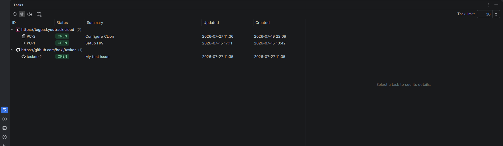
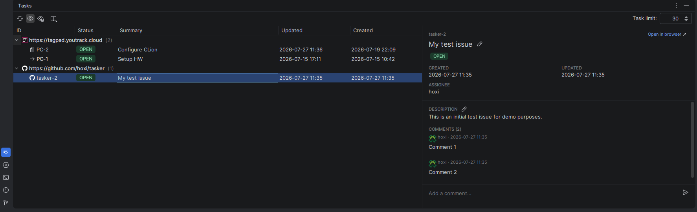
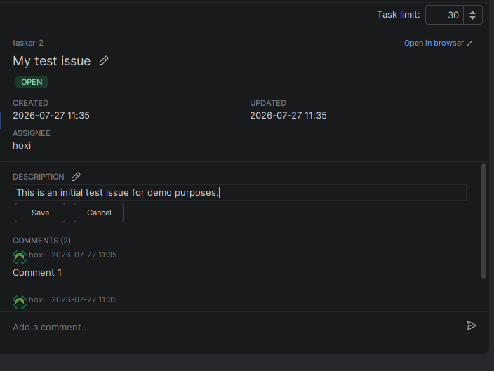
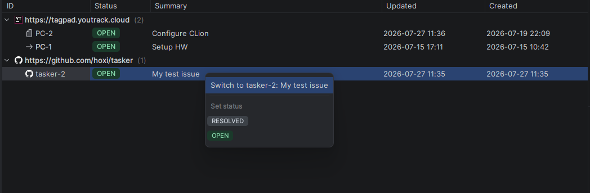

# Tasker



## Overview

An IntelliJ IDEA tool window that puts every issue from every configured task server in one sortable, groupable table —
with a details pane you can edit in place.

The bundled **Task Management** plugin already knows how to talk to your trackers, but it only surfaces them through a
search popup, one issue at a time. Tasker reuses those same server connections and shows the lot as a table you can
actually work in.

## Requirements

- IntelliJ IDEA **2026.1** or newer (build 261+)
- The **Task Management** plugin (`com.intellij.tasks`) installed and enabled — Tasker depends on it outright and will
  not load without it
- At least one task server configured under **Settings | Tools | Tasks | Servers**

Tasker adds no credentials or settings of its own. Every server, token and connection it uses is the one you already
configured for Task Management.

### You may need to install Task Management yourself

Task Management used to ship with the IDE, and in some JetBrains products it no longer does — IntelliJ IDEA 2026.2, for
one, has no `plugins/tasks` in its distribution. Where that is the case, install
[Task Management](https://plugins.jetbrains.com/plugin/11545-task-management) from the Marketplace first. Tasker
declares a hard dependency on it, so without it Tasker will not load at all rather than degrading.

The direction of travel is towards it being unbundled everywhere, so expect this to apply to more products from 2026.3
onwards. Nothing changes for Tasker either way: it asks for the plugin by id and uses it wherever it comes from.

## The task list

Opens as the **Tasks** tool window at the bottom of the IDE.

- **Columns** — ID, Status, Summary, Updated, Created. Click a header to sort; drag to reorder anything except ID, which
  stays pinned to the left because it carries the tree.
- **Grouping** — tasks sit under their server by default. Turn *Group by Server* off for a flat list, where each row
  shows its server's icon instead.
- **Status** — rendered as a coloured badge using the tracker's own state name, not a flattened approximation of it.
- **The active task** is marked with a right arrow and bold text, and it updates the moment you switch, however you
  switch.
- **Closed issues** are hidden by default and greyed when shown.
- **Task limit** caps how many issues are requested per server. Lower is faster; the default is 30.

Servers load in parallel and the tree fills in as each one answers, so a slow tracker never holds up the rest. One that
fails says so on its own row and leaves the others alone.

## The details pane



Select a row and the pane shows the issue's id, title, status, dates, whatever extra fields the tracker exposes, its
description, and its comments. Comments and the full description are fetched lazily on selection and cached, so the list
load never pays for them.

### Editing in place

The pen next to the **title** and the **description** turns them into editable text right where they sit — no dialog, no
jump.

- `Enter` commits a title, `Escape` cancels
- The description has Save and Cancel buttons; `Escape` cancels
- The composer at the foot of the pane posts a comment — `Enter` sends, `Shift+Enter` inserts a newline



An action that a tracker can't perform is greyed out with a tooltip explaining which of the two reasons applies: the
provider doesn't support it at all, or this particular issue isn't addressable.

## Right-click menu



- **Switch to `<task>`** hands the issue to Task Management exactly as its own *Open Task* chooser does:
  an issue you've already worked on is activated outright, a new one opens the Open Task dialog, which is where the
  changelist, branch and context options live.
- **Set status** lists only the transitions the server says are legal from the issue's current state, so a Jira workflow
  offers just the steps it actually permits.

## Toolbar

|                        |                                                                                                                                                  |
|------------------------|--------------------------------------------------------------------------------------------------------------------------------------------------|
| **Refresh**            | Reload every server and drop cached comments                                                                                                     |
| **Group by Server**    | Toggle the per-server tree                                                                                                                       |
| **Show Closed Issues** | Fetch and show closed/resolved issues too                                                                                                        |
| **Tasks & Contexts**   | The bundled plugin's own menu — Switch Task, Open Task, Close Task, Save/Load/Clear Context, Configure Servers — without going to the Tools menu |
| **Task limit**         | Issues requested per server                                                                                                                      |

## What works per provider

Status changes go through the platform, so they work with **any** tracker that reports support for them. Everything else
needs a provider adapter, because the platform's task API has no notion of renaming an issue, editing its description,
or posting a comment.

| Provider                         | Rename | Description | Comment | Extra fields shown             |
|----------------------------------|:------:|:-----------:|:-------:|--------------------------------|
| GitHub                           |   ✅   |     ✅      |   ✅    | Assignee                       |
| GitLab                           |   ✅   |     ✅      |   ✅    | Assignee, Time spent, Estimate |
| YouTrack                         |   ✅   |     ✅      |   ✅    | Priority, Type, Assignee       |
| Jira, Redmine, Trac, Bugzilla, … |   —    |      —      |    —    | —                              |

Notes:

- **YouTrack's fields come free** — it's the only bundled provider that populates the platform's custom properties, and
  Tasker renders that map generically. `Type` only appears if your YouTrack project defines a custom field named exactly
  `Type` and the issue has a value for it.
- **GitLab's "Time spent" is real** — it's what everyone has logged against the issue, read from
  `time_stats`. GitHub's issue API has no time tracking at all.
- **"Tracked in IDE"** is a separate row, shown for any provider once you've switched to the task. That one is the IDE's
  own stopwatch, not anything the tracker knows about.
- Adding labels, milestones or due dates is a line per adapter — the plumbing is generic.

Providers without an adapter still list, sort, group and change status perfectly well; they just can't be edited from
the pane.

## Building

Needs JDK 25.

```bash
./gradlew buildPlugin      # -> build/distributions/Tasker-<version>.zip
./gradlew runIde           # launch a sandbox IDE with the plugin loaded
./gradlew verifyPlugin     # run the JetBrains plugin verifier
```

Install the built zip through **Settings | Plugins | ⚙ | Install Plugin from Disk…**.

## Licence

[MIT](LICENSE) © 2026 Magnus Wållberg
